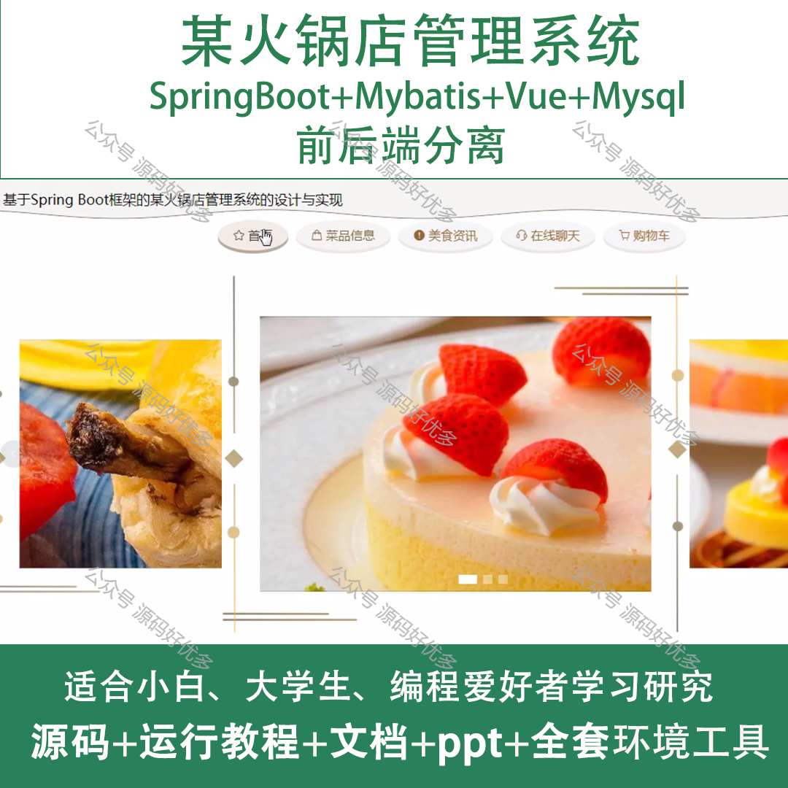
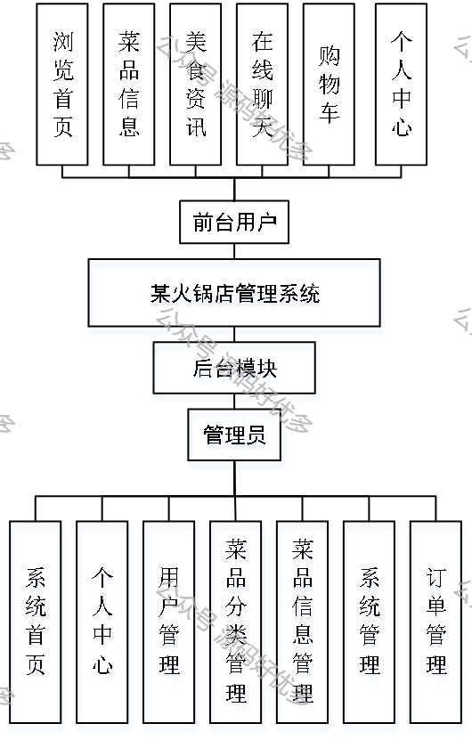
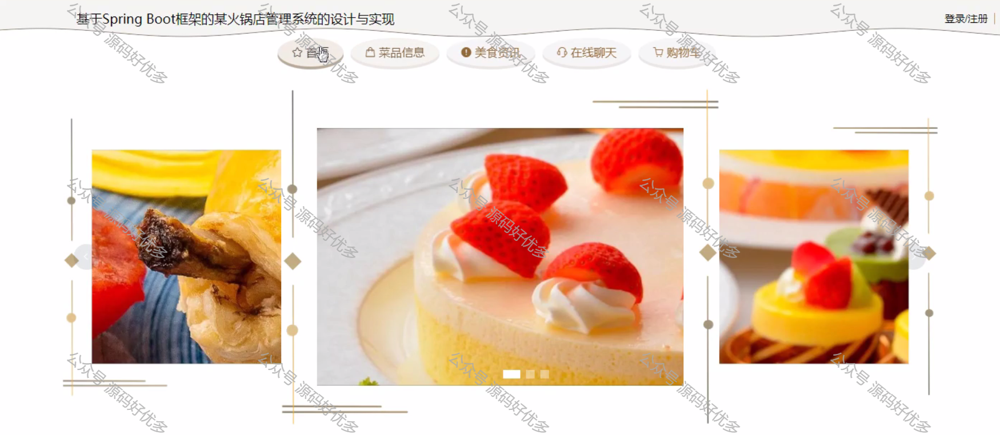
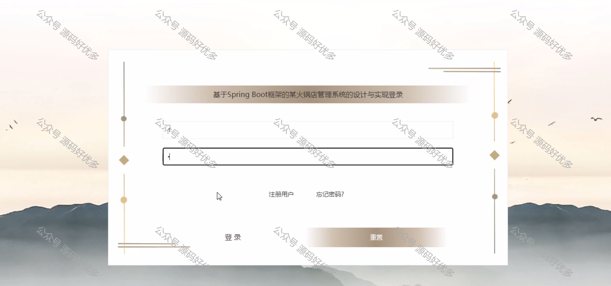
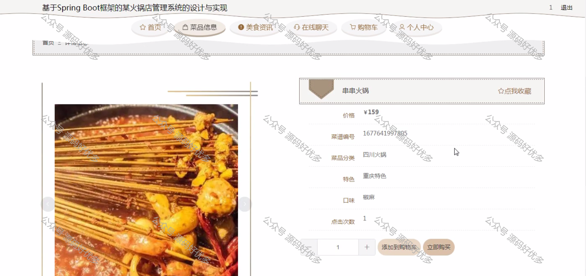
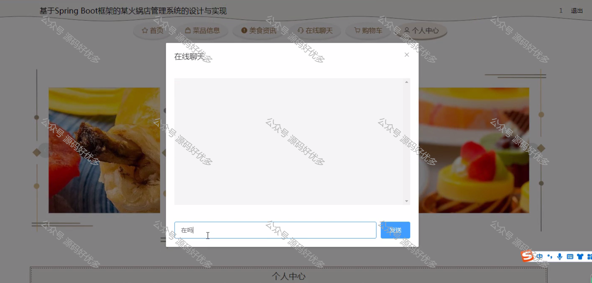
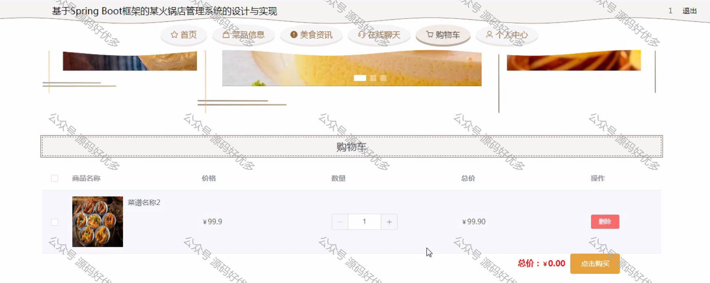
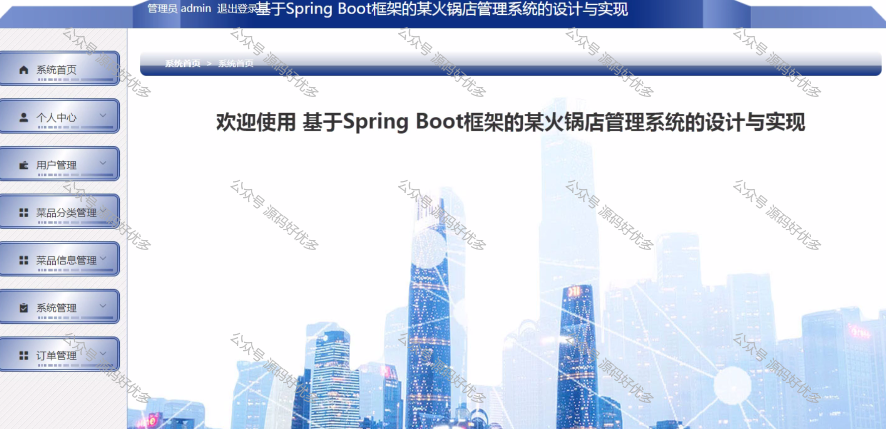
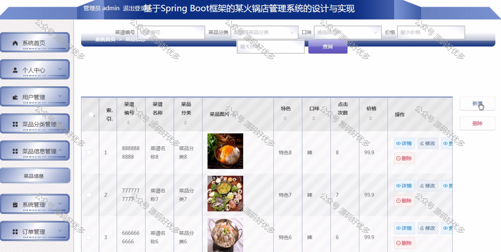
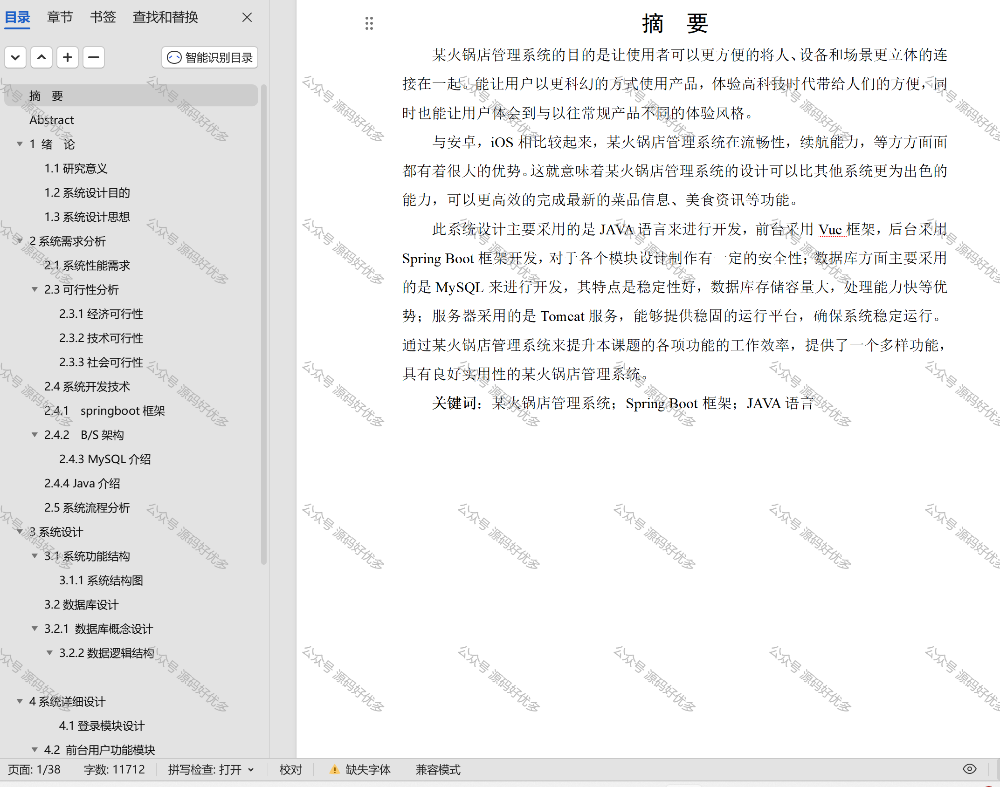

 
## 查看主页获取源码

> **作者介绍**： **✌**全网粉丝10W+本平台特邀作者、博客专家、CSDN新星计划导师、java领域优质创作者,博客之星、掘金/华为云/阿里云/InfoQ等平台优质作者、专注于项目实战 **✌**

  

### 一、作品包含

源码+数据库+设计文档万字+PPT+全套环境和工具资源+部署教程

### 二、项目技术

前端技术：Html、Css、Js、Vue、Element-ui

数据库：MySQL

后端技术：Java、Spring Boot、MyBatis

  

### 三、运行环境

开发工具：IDEA/eclipse

数据库：MySQL5.7

数据库管理工具：Navicat10以上版本

环境配置软件： JDK1.8+Maven3.6.3

前端Nodejs：14

  

### 四、项目介绍
项目编号：springbootA110

火锅店管理系统，有效提升了火锅店的运营效率和服务质量。
该系统包括前台用户、后台模块和管理员三个角色，其中前台用户具有浏览首页、菜品信息、美食资讯、在线聊天、购物车和个人中心的功能；后台模块具有某火锅店管理系统，管理员具有系统首页、个人中心、用户管理、菜品分类管理、菜品信息管理、系统管理和订单管理的功能。

### 五、运行截图

  
